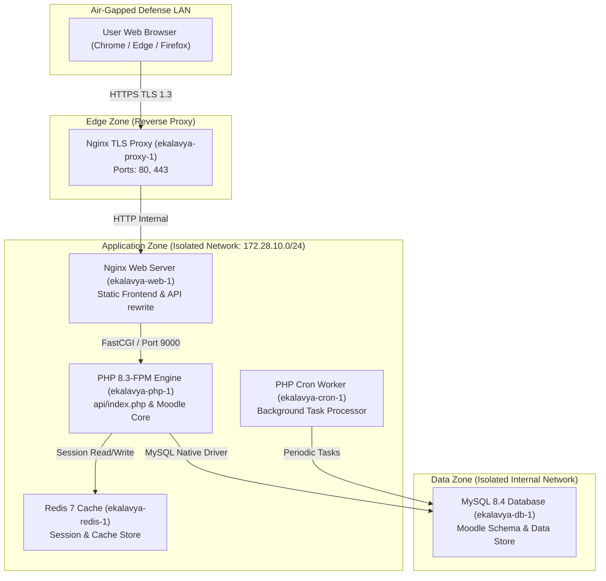
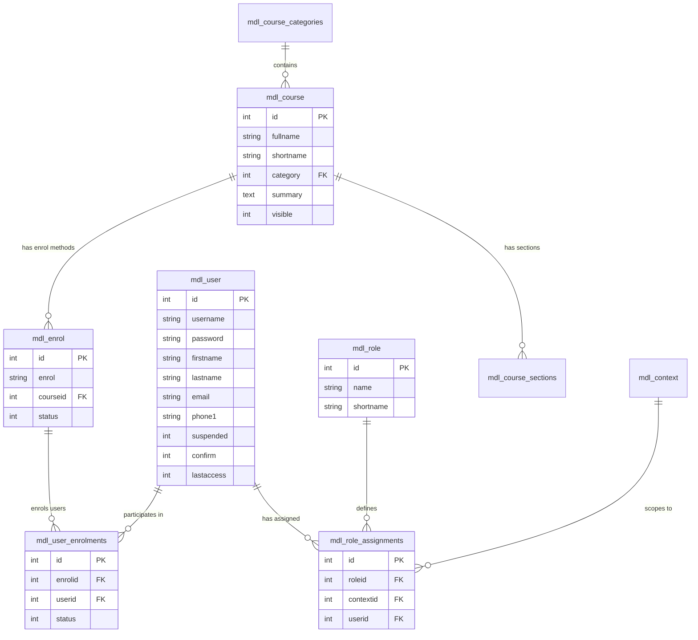
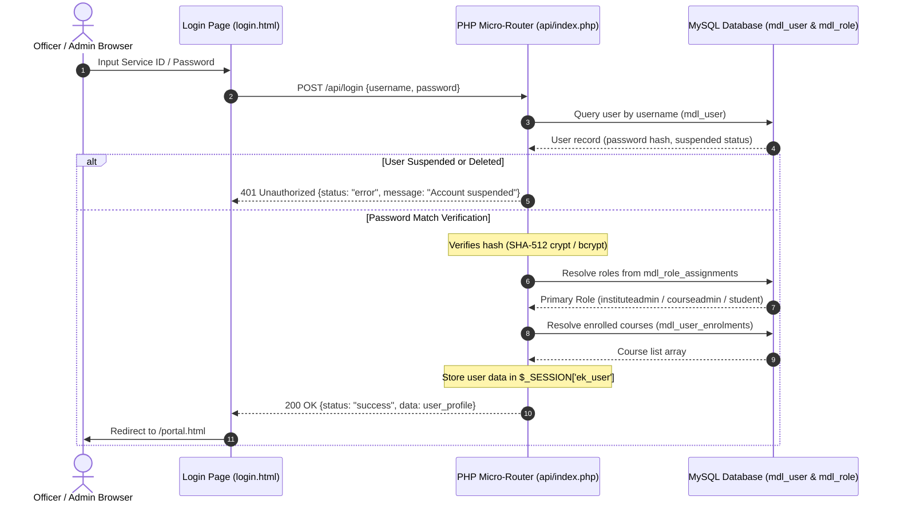
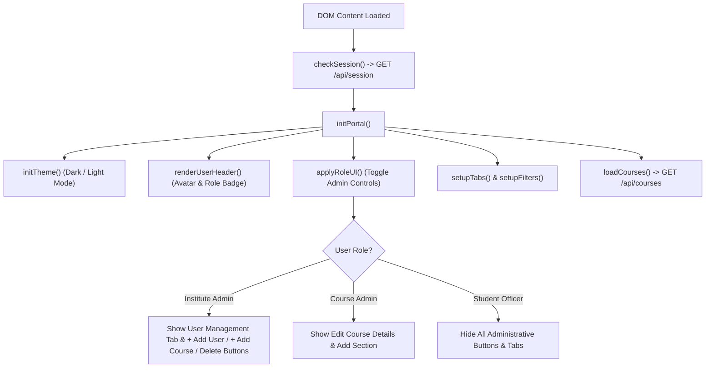
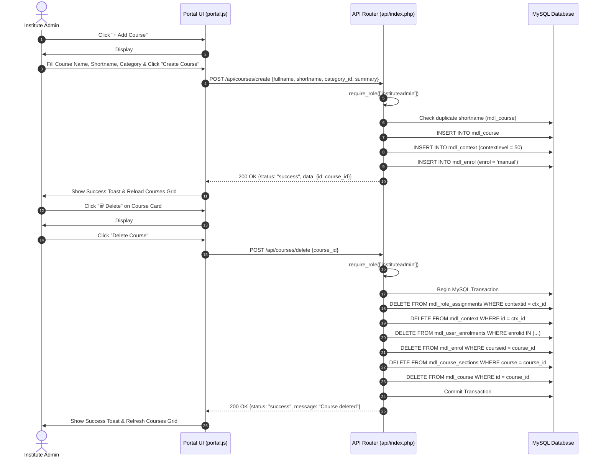

# EKALAVYA LMS — REPLICATION PIPELINE & ARCHITECTURE SPECIFICATION
**Officers Training College (OTC), AMC Centre & College, Lucknow**
*Air-Gapped On-Premise Defence E-Learning Platform*

> [!IMPORTANT]
> **Replication Notice**: This document contains the complete end-to-end technical workflow, architecture topology, database schema mappings, API specifications, RBAC rules, frontend SPA state engine, and replication steps required for an AI agent or developer to reconstruct the working Ekalavya LMS project from scratch.

---

## 1. System Topology & Air-Gap Architecture

The application runs in a multi-container Docker environment simulating an air-gapped defence network topology without external internet egress.



### Container Services Breakdown (`docker-compose.yml`)

1. **`proxy` (`nginx:1.27-alpine`)**:
   - Facing LAN client network (Ports `80`, `443`). Serves static frontend files (`frontend/`) and forwards API requests `/api/*` to the web container.
2. **`web` (`nginx:1.27-alpine`)**:
   - Internal Web Server hosting Moodle source (`/var/www/moodle`) and API endpoints (`/var/www/moodle/public/api`).
3. **`php` (`ekalavya-php`)**:
   - Custom PHP 8.3-FPM image loaded with `mysqli`, `pdo_mysql`, `gd`, `zip`, `xml`, `mbstring`, and `intl` extensions. Executes [`api/index.php`](file:///d:/ekalavya-lms/api/index.php).
4. **`cron` (`ekalavya-cron`)**:
   - Runs `scripts/cron-loop.sh` to execute background scheduled tasks.
5. **`redis` (`redis:7-alpine`)**:
   - In-memory cache store.
6. **`db` (`mysql:8.4`)**:
   - MySQL 8.4 server configured with `utf8mb4_unicode_ci`, InnoDB buffer pool of 1GB, max connections 300. Stores Moodle relational data.

---

## 2. Relational Database Schema & Moodle Integration

The application reuses existing Moodle database tables without modifying schema structure.



### Core Role Mapping in `mdl_role`

| Shortname | Role Name | System Capabilities & UI Access |
|---|---|---|
| `instituteadmin` | Institute Admin | Full User Management (Create/Edit users, Assign roles, Assign courses), Full Course Management (Create course, Delete course with cascading purge, Edit course details), Section Management, Security Governance. |
| `courseadmin` | Course Admin | Access to assigned courses, section/module creation, content updating for assigned courses. Restricted from user management and course deletion. |
| `student` | Student Officer | Access to assigned courses, view classroom video streams, take module quizzes, track personal progress. Read-only permissions. |

---

## 3. Authentication & Session Pipeline



---

## 4. API Endpoints & Request Handling Pipeline

The backend API micro-router [`api/index.php`](file:///d:/ekalavya-lms/api/index.php) parses request URIs, extracts path parameters, enforces server-side role validation via `require_role()`, and returns standard JSON responses.

### Complete API Specification

#### Authentication & Session
- `POST /api/login`: Validates credentials against `mdl_user`, resolves role from `mdl_role_assignments`, initializes PHP session.
- `GET /api/session`: Returns current session user object or `{authenticated: false}`.
- `GET /api/logout`: Destroys session and clears cookies.
- `GET /api/status`: Public status endpoint returning course counts, user counts, and system metrics.

#### User Management (Institute Admin Only)
- `GET /api/users`: Returns list of all active users, their role badges, account status (`suspended`), and enrolled course IDs. (Guarded by `require_role(['instituteadmin'])`).
- `POST /api/users/create`: Creates a new user record in `mdl_user`, hashes password with Bcrypt, creates role assignment in `mdl_role_assignments`, and enrols in initial courses.
- `POST /api/users/update`: Updates user profile (`firstname`, `lastname`, `email`, `mobile`, `suspended` status, and optional password reset).
- `POST /api/users/update-role`: Updates user role (`instituteadmin`, `courseadmin`, `student`) by updating `mdl_role_assignments`.
- `GET /api/users/{id}/courses`: Returns enrolled courses for a given user ID.
- `POST /api/users/{id}/courses/assign`: Assigns a course to a user by inserting into `mdl_user_enrolments` and `mdl_role_assignments`.
- `POST /api/users/{id}/courses/remove`: Removes course enrolment from `mdl_user_enrolments`.

#### Course Management
- `GET /api/courses`: Returns list of courses with category info and `can_edit` / `can_delete` flags evaluated per user role.
- `POST /api/courses/create`: Creates course in `mdl_course`, initializes course context (`mdl_context` level 50), and creates manual enrolment record in `mdl_enrol`. (Guarded by `require_role(['instituteadmin'])`).
- `POST /api/courses/delete`: Performs safe transactional deletion of a course, purging related `mdl_role_assignments`, `mdl_context`, `mdl_user_enrolments`, `mdl_enrol`, `mdl_course_sections`, and `mdl_course`. (Guarded by `require_role(['instituteadmin'])`).
- `POST /api/course-update`: Updates course `fullname` and `summary`.

---

## 5. Frontend SPA Architecture & UI State Engine

The frontend is built with pure **HTML5**, **Vanilla CSS3**, and **ES6 JavaScript** ([`portal.html`](file:///d:/ekalavya-lms/frontend/portal.html), [`portal.js`](file:///d:/ekalavya-lms/frontend/js/portal.js), [`style.css`](file:///d:/ekalavya-lms/frontend/css/style.css)).



### Key UI Features & Workflows

1. **Dual Theme Engine (Dark & Normal Light Mode)**:
   - Toggles body class `theme-dark` / `theme-light` and `[data-theme="light"]` attribute.
   - Enforces solid font visibility, high-contrast badges, and customized modal dialog background colors across all themes.
2. **Global Page Navigation Stack (`goBack()` / `goNext()`)**:
   - Tracks tab switching history in `navHistory` array.
   - Enables/disables header `Back` and `Next` buttons dynamically based on history state.
3. **User Management Modal (`#modal-user-form`)**:
   - Supports creating new users and configuring existing users.
   - Includes form fields for Service ID/Username, First/Last Name, Password, Email, Mobile Number, Account Status (Active/Suspended), Role Radio Select, and a scrollable **Assigned Courses Checklist**.
4. **Add Course Modal (`#modal-add-course`)**:
   - Collects Course Full Name, Short Name (Code), Category, Summary, and Visibility Status.
5. **Delete Course Confirmation Modal (`#modal-delete-course-confirm`)**:
   - Presents explicit danger warning before invoking transactional course deletion.

---

## 6. Execution Sequence Diagrams

### Institute Admin Course Creation & Deletion Flow



---

## 7. Complete Step-by-Step Project Replication Guide

To replicate this project on another machine or agent context:

### Step 1: Clone Repository & File Structure
Ensure the following directory structure is created:
```text
ekalavya-lms/
├── docker-compose.yml
├── .env
├── api/
│   ├── index.php
│   └── db.php
├── frontend/
│   ├── index.html
│   ├── login.html
│   ├── portal.html
│   ├── css/
│   │   └── style.css
│   ├── js/
│   │   └── portal.js
│   └── OTC.png
├── config/
│   └── config.php
├── scripts/
│   ├── 01-install.sh
│   ├── 02-harden.sh
│   ├── 03-structure.php
│   ├── 04-verify.php
│   └── 05-demo-users.php
└── docker/
    ├── php/
    ├── proxy/
    └── web/
```

### Step 2: Environment Configuration (`.env`)
Create `.env`:
```env
DB_HOST=db
DB_NAME=moodle
DB_USER=moodle
DB_PASS=Ek@l4vya#Db!Pass2026
DB_ROOT_PASS=root_secret_2026
REDIS_HOST=redis
REDIS_PASSWORD=redis_secret_2026
MOODLE_WWWROOT=https://ekalavya.local
MOODLE_SITE_FULLNAME="Ekalavya - Officers Training College, AMC Centre and College"
MOODLE_SITE_SHORTNAME=Ekalavya
MOODLE_DEBUG=1
MOODLE_ADMIN_USER=siteadmin
MOODLE_ADMIN_PASS=Change-Me-Str0ng!Pass
MOODLE_ADMIN_EMAIL=siteadmin@ekalavya.local
TRUSTED_PROXY_SUBNET=172.28.10.0/24
```

### Step 3: Launch Stack via Docker Compose
Run:
```bash
docker compose up -d --build
```
Verify container status (`docker ps`): `ekalavya-proxy-1`, `ekalavya-web-1`, `ekalavya-php-1`, `ekalavya-cron-1`, `ekalavya-redis-1`, `ekalavya-db-1`.

### Step 4: Seed Database & Demo Users
Run seed scripts inside the PHP container:
```bash
docker compose exec -u www-data php bash /opt/ekalavya/scripts/01-install.sh
docker compose exec -u www-data php bash /opt/ekalavya/scripts/02-harden.sh
docker compose exec -u www-data php php /opt/ekalavya/scripts/03-structure.php --batch=2026
docker compose exec -u www-data php php /opt/ekalavya/scripts/05-demo-users.php
```

Default Credentials for Verification:
- **Institute Admin**: Username `inst.admin` | Password `InstAdmin@2026!`
- **Course Admin**: Username `course.admin` | Password `CourseAdmin@2026!`
- **Student Officer**: Username `student.officer` | Password `Student@2026!`

### Step 5: Automated Security & RBAC Audit
Run the automated Python audit script to verify endpoint protection:
```bash
python scratch/test_admin_rbac.py
```
Expected output:
```text
=== EKALAVYA LMS RBAC SECURITY & FUNCTIONALITY AUDIT ===
[OK] Student authenticated: student.officer (Role: student)
  [Security Guard] POST /users/create correctly blocked for Student (HTTP 403 Forbidden)
  [Security Guard] POST /users/update-role correctly blocked for Student (HTTP 403 Forbidden)
  [Security Guard] POST /courses/create correctly blocked for Student (HTTP 403 Forbidden)
  [Security Guard] POST /courses/delete correctly blocked for Student (HTTP 403 Forbidden)
  [Security Guard] GET /users correctly blocked for Student (HTTP 403 Forbidden)
[OK] Institute Admin authenticated: inst.admin (Role: instituteadmin)
[OK] Institute Admin fetched registered users
[OK] Institute Admin created new user: test.officer01
[OK] Institute Admin updated user role to Course Admin
[OK] Institute Admin created course: Tactical Battlefield Medicine 2026
[OK] Institute Admin assigned course to user
[OK] Verified course enrolment for user
[OK] Institute Admin removed course assignment from user
[OK] Institute Admin safely deleted course

=== ALL RBAC SECURITY & FUNCTIONALITY TESTS PASSED SUCCESSFULLY ===
```
